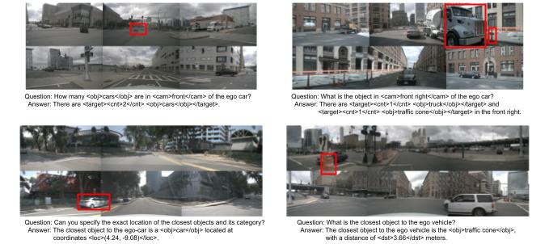

# NuScenes-MQA



## Abstract
Visual Question Answering (VQA) is one of the most important tasks in autonomous driving, which requires accurate recognition and complex situation evaluations. However, datasets annotated in a QA format, which guarantees precise language generation and scene recognition from driving scenes, have not been established yet. In this work, we introduce Markup-QA, a novel dataset annotation technique in which QAs are enclosed within markups. This approach facilitates the simultaneous evaluation of a model's capabilities in sentence generation and VQA. Moreover, using this annotation methodology, we designed the NuScenes-MQA dataset. This dataset empowers the development of vision language models, especially for autonomous driving tasks, by focusing on both descriptive capabilities and precise QA.

## Markup-QA Annotation

NuScenes-MQA annotations are available from [here](https://drive.google.com/drive/u/0/folders/1PQy0qhTtbdueIVlVnn4jC6xvANZUynRZ).

## Paper information
- **NuScenes-MQA: Integrated Evaluation of Captions and QA for Autonomous Driving Datasets using Markup Annotations**
- **arXiv**: [https://arxiv.org/abs/2312.06352](https://arxiv.org/abs/2312.06352)
- **Slides**: [link](https://docs.google.com/presentation/d/1mUtU9S7VVBmDy7nZo_PzmuVxSpeQracD9x_1B2zc-2g/edit#slide=id.g2a7ef2f5709_0_226)

## This paper was accepted at the LLVM-AD Workshop at WACV
- **Workshop**: LLVM-AD at WACV
- **Year**: 2024/1
- **Website**: [https://llvm-ad.github.io/](https://llvm-ad.github.io/)


## BibTeX
```bibtex
@InProceedings{Inoue_2024_WACV,
    author    = {Inoue, Yuichi and Yada, Yuki and Tanahashi, Kotaro and Yamaguchi, Yu},
    title     = {NuScenes-MQA: Integrated Evaluation of Captions and QA for Autonomous Driving Datasets Using Markup Annotations},
    booktitle = {Proceedings of the IEEE/CVF Winter Conference on Applications of Computer Vision (WACV) Workshops},
    month     = {January},
    year      = {2024},
    pages     = {930-938}
}
```
